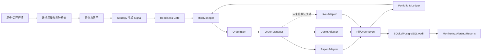

# 加密货币自动交易系统项目计划书

## 1. 文档控制

| 项目 | 内容 |
|---|---|
| 文档版本 | 1.0 |
| 基线日期 | 2026-07-21 |
| 项目目录 | `D:\AI\crypto-trading-bot` |
| 当前版本 | `0.1.0` |
| 当前 Git 基线 | `research-freeze-20260520` / `cadeb2f` |
| 当前阶段 | 离线研究冻结，禁止长期 paper，禁止实盘 |
| 文档用途 | 作为后续需求、开发、测试、验收和阶段准入的统一基线 |

本文档是项目执行依据。后续新增功能、调整风险阈值或改变交易范围时，应先更新本文档或补充决策记录，再实施代码修改。时间目标不能覆盖安全门禁和质量门禁。

## 2. 执行摘要

本项目目标是建设一套安全优先、可回测、可回放、可审计的加密货币自动交易系统。系统按离线研究、虚拟撮合、交易所 Demo、小额实盘灰度四个运行层级逐步推进。

当前项目已经具备 CSV/公开 OHLCV 数据、多个研究策略、回测、参数扫描、rolling walk-forward、PaperExecutionEngine、基础 RiskManager、SQLite 审计、报告导出和 113 项自动化测试。真实下单仍被代码无条件禁止。

当前策略池全部为 `not_ready`。因此近期目标不是接入真实资金，而是：

1. 补齐长期 paper 所需的状态恢复、完整风控、幂等和可观测性。
2. 加强策略样本外验证、成本压力测试和基准比较。
3. 只有策略达到 `paper_ready` 后，才允许连接交易所 Demo 环境。
4. 只有 Demo 稳定运行并达到全部安全门禁后，才允许设计受控实盘执行接口。

## 3. 项目原则

以下原则不可因进度、回测收益或临时需要而绕过：

1. 默认模式为 `paper`，默认 `live_trading=false`。
2. 策略只生成 `Signal`，不得持有交易所客户端或直接下单。
3. 所有订单必须经过统一的 `RiskManager`。
4. 任何未明确确认的状态都按失败处理，即 fail closed。
5. 真实下单能力在达到实盘准入条件前保持不存在或无条件抛出 `SafetyError`。
6. API Key 不进入代码、Git、日志、报告或聊天内容。
7. 不授予提现、转账、借贷权限；第一阶段只研究现货，不使用杠杆、合约、网格和高频。
8. 所有行情、信号、风控、订单、成交、状态变更和人工操作可回放、可审计。
9. 回测、优化和 paper 结果都不构成收益保证。
10. 研究准入门槛只能通过正式变更评审调整，不得为了让策略“通过”而临时放宽。
11. 项目以安全性、证据完整性和长期可运营性优先，阶段时间是估算而不是交付倒计时。
12. 从 Phase 1 开始持续使用真实公开市场数据进行 shadow 和 paper 迭代，不能只依赖静态历史样本或人工构造数据。
13. 外部案例用于发现风险和验证设计，不直接替代本项目的测试、审计和准入流程。

## 4. 项目目标与非目标

### 4.1 项目目标

- 建立可靠的历史数据研究和策略评估平台。
- 建立确定性、可重放的回测与 paper 撮合系统。
- 建立覆盖交易前、持仓中、账户级和系统级的风控体系。
- 建立能够跨进程重启恢复的账户、订单和运行状态。
- 建立交易所 Demo 环境下的订单生命周期管理和对账能力。
- 建立监控、告警、审计、备份和故障恢复能力。
- 在满足全部准入条件后，为单交易所、单交易对、现货、小资金实盘灰度预留严格受控的接口。

### 4.2 当前非目标

- 不承诺或追求固定收益率。
- 不实现自动实盘开关或无人审批的资金扩容。
- 不实现提现、转账、借贷和资金托管。
- 不实现杠杆、永续合约、期货、期权和保证金交易。
- 不实现高频、做市、套利、网格和自动追单。
- 不在当前阶段引入机器学习自动调参或在线学习。
- 不在策略 `not_ready` 时通过修改门槛强行进入 paper/live。
- 不绕过地区、网络、交易所账户或监管限制。

## 5. 当前基线与差距

| 能力 | 状态 | 当前说明 | 后续要求 |
|---|---|---|---|
| Python/src layout/CLI | 已完成 | Python 3.11.9，editable 安装正常 | 保持兼容并加入 CI |
| CSV 数据读取与校验 | 已完成 | 支持标准化、重复、缺失、OHLC 校验 | 增加数据版本和校验摘要绑定 |
| 公开实时行情 | 已完成 | ccxt 仅调用 `fetch_ohlcv`，支持 Binance/OKX | 增加已收盘 K 线判定和时间偏差检查 |
| 实时数据持续归档 | 未完成 | 当前只按运行轮次临时拉取 | 建立原始数据归档、延迟监控和可回放数据集 |
| 策略接口 | 已完成 | Strategy 只产生 Signal | 增加策略元数据、版本和 readiness 状态 |
| 回测 | 已完成 | 手续费、滑点、权益、风险事件和报告 | 增加基准、成本压力、随机化测试 |
| 参数优化 | 已完成 | 参数扫描和 rolling walk-forward | 增加参数稳定性和选择偏差控制 |
| PaperExecutionEngine | 部分完成 | 模拟成交并要求 `risk_checked` | 改为不可伪造的风控审批凭证 |
| Paper 运行循环 | 部分完成 | 有循环、快照、重复 K 线保护 | 增加账户恢复、策略工厂和长期状态 |
| 风控 | 部分完成 | 仓位、回撤、异常行情等基础规则 | 落地止损止盈、每日亏损和组合级限制 |
| SQLite 审计 | 部分完成 | 记录信号、订单、成交和 paper 快照 | 增加迁移、事件状态和完整恢复 |
| 监控告警 | 未完成 | 主要依靠日志和 daily summary | 增加指标、健康检查和独立告警 |
| Demo 私有执行 | 未开始 | 当前禁止读取 API Key | 仅在 `paper_ready` 后开始 |
| 交易所对账 | 未开始 | 无私有账户信息 | Demo 阶段实现 |
| 实盘执行 | 禁止 | LiveExecutionClient 无条件拒绝 | 最后阶段、独立审批后才设计 |
| 策略准入 | 研究逻辑已完成 | 当前所有策略 `not_ready` | 增加代码级运行门禁 |
| CI/静态检查 | 未完成 | 本地 pytest 113 项通过 | 增加 CI、ruff、类型和覆盖率门槛 |

## 6. 系统架构



### 6.1 模块边界

- `market`：行情读取、标准化、完整性、时效性和已收盘判断；不得调用交易接口。
- `strategy`：因子计算和 Signal 生成；不得导入 execution 或交易所私有客户端。
- `risk`：统一审批、调整数量和拒绝；不得自行发送订单。
- `execution`：执行已审批的 OrderIntent；不得绕过 RiskManager。
- `portfolio`：现金、持仓、成本、盈亏、权益和回撤。
- `storage`：事件、快照、幂等键、迁移和恢复。
- `backtest`：历史事件循环、虚拟执行和指标计算。
- `paper`：实时/回放行情驱动的长期虚拟账户。
- `optimization`：参数扫描和样本外验证，不参与运行时交易。
- `monitoring`：日志、指标、健康检查和告警，不改变交易决策。
- `cli`：编排和人工入口，不承载核心交易逻辑。

### 6.2 交易数据流

1. MarketDataProvider 获取行情。
2. DataQualityGate 检查字段、时间、重复、缺失、异常价格和 K 线是否收盘。
3. Strategy 使用截止当前时刻可见的数据生成 Signal。
4. ReadinessGate 检查策略是否允许进入当前模式。
5. RiskManager 根据账户、持仓、当日状态和行情生成 RiskDecision。
6. 仅 approved 决策生成带审批凭证的 OrderIntent。
7. OrderManager 分配幂等订单号并持久化 `CREATED` 状态。
8. ExecutionAdapter 执行 paper 或 Demo 请求。
9. 订单和成交事件更新本地账本。
10. Reconciliation 对比本地与交易所状态；差异触发熔断。
11. 全流程写入审计日志、指标和报告。

## 7. 功能需求

### 7.1 行情与数据需求

| 编号 | 需求 | 验收重点 |
|---|---|---|
| FR-DATA-001 | 支持项目标准 OHLCV CSV | 列固定为 timestamp/open/high/low/close/volume |
| FR-DATA-002 | 支持 Binance/OKX 公开 OHLCV | 只允许公开接口，当前只使用 `fetch_ohlcv` |
| FR-DATA-003 | 校验缺失、重复、乱序和 OHLC 关系 | 无效数据不得进入策略 |
| FR-DATA-004 | 检查行情时效性和未来时间戳 | 陈旧或未来数据暂停本轮 |
| FR-DATA-005 | 只使用已收盘 K 线生成交易 Signal | 当前形成中的 K 线不得触发交易 |
| FR-DATA-006 | 保存数据来源、抓取时间、校验摘要 | 回测报告可追溯到数据版本 |
| FR-DATA-007 | 同 symbol/timeframe/timestamp 幂等处理 | 重启后不重复交易 |
| FR-DATA-008 | 网络/API 异常分类和退避重试 | 重试不导致重复处理 |
| FR-DATA-009 | 持续采集真实公开市场数据 | 原始响应和标准化数据均可追溯 |
| FR-DATA-010 | 记录接收时间、交易所时间和处理时间 | 可计算端到端行情延迟 |
| FR-DATA-011 | 实时数据自动形成不可变回放集 | 后续版本可在完全相同的数据上回归 |
| FR-DATA-012 | 数据源健康度和缺口报告 | 每日输出延迟、缺口、重复和异常统计 |
| FR-DATA-013 | 支持实时 shadow 模式 | 生成信号和风控结果，但绝不产生订单 |
| FR-DATA-014 | 支持真实行情驱动的本地 paper | 使用本地虚拟账户，不依赖交易所模拟流动性 |

### 7.2 策略与因子需求

| 编号 | 需求 | 验收重点 |
|---|---|---|
| FR-STR-001 | Strategy 只能返回 Signal | 静态扫描和单测禁止执行层依赖 |
| FR-STR-002 | Signal 包含 id、时间、方向、价格和原因 | 每个订单可追溯到来源 Signal |
| FR-STR-003 | 策略配置可版本化 | 报告和运行记录包含策略版本/参数哈希 |
| FR-STR-004 | 策略状态支持 not_ready/paper_ready/live_ready | 启动时由代码强制检查 |
| FR-STR-005 | 策略支持确定性回放 | 同数据、同配置产生相同结果 |
| FR-STR-006 | paper 使用统一策略工厂 | 不再固定实例化 MA 策略 |

### 7.3 风控需求

| 编号 | 需求 | 验收重点 |
|---|---|---|
| FR-RISK-001 | 单笔最大仓位比例 | 超限时拒绝或按明确规则缩量 |
| FR-RISK-002 | 单交易对和账户总敞口限制 | 多交易对合计不能突破账户上限 |
| FR-RISK-003 | 每日最大亏损 | 达限后当日停止，重启不能清零 |
| FR-RISK-004 | 最大回撤 | 达限后熔断且必须人工恢复 |
| FR-RISK-005 | 止损和止盈 | 使用明确价格来源并记录触发原因 |
| FR-RISK-006 | 禁止无限加仓 | 默认不允许 pyramiding |
| FR-RISK-007 | 每日最大交易次数 | 跨进程保持准确计数 |
| FR-RISK-008 | 异常行情和缺失数据暂停 | fail closed，记录原因 |
| FR-RISK-009 | 最小金额、价格和数量精度检查 | 与交易所 instrument 规则一致 |
| FR-RISK-010 | 连续亏损、账本差异和系统异常熔断 | 不自动解除严重熔断 |
| FR-RISK-011 | 风控审批凭证不可由普通调用方伪造 | ExecutionEngine 验证审批来源 |
| FR-RISK-012 | 风险参数变更需审计和人工批准 | 运行中不得静默放宽 |

### 7.4 账户、持仓与账本需求

| 编号 | 需求 | 验收重点 |
|---|---|---|
| FR-PORT-001 | 记录现金、冻结金额和可用金额 | 任意时点可重建 |
| FR-PORT-002 | 记录持仓数量、均价和市值 | 支持部分成交和部分卖出 |
| FR-PORT-003 | 计算已实现/未实现盈亏 | 手续费计入口径一致 |
| FR-PORT-004 | 记录权益、峰值权益和回撤 | 重启后连续 |
| FR-PORT-005 | 从事件和快照恢复账户 | 恢复结果与停止前一致 |
| FR-PORT-006 | 账本使用明确精度规则 | 避免浮点累计误差，优先 Decimal |

### 7.5 订单与执行需求

| 编号 | 需求 | 验收重点 |
|---|---|---|
| FR-EXEC-001 | 订单状态机完整持久化 | CREATED 到终态均可审计 |
| FR-EXEC-002 | 使用唯一 client_order_id | 重试和重启不产生重复订单 |
| FR-EXEC-003 | 支持部分成交、拒单、撤单和超时 | 状态转换合法且可恢复 |
| FR-EXEC-004 | UNKNOWN 状态停止新订单 | 对账完成前 fail closed |
| FR-EXEC-005 | Paper/Demo/Live 实现统一接口 | 模式切换不改变策略和风控 |
| FR-EXEC-006 | Paper 模拟手续费、滑点和资金不足 | 结果可复现 |
| FR-EXEC-007 | Demo 执行只连接模拟环境 | 环境标识和端点双重校验 |
| FR-EXEC-008 | LiveExecution 默认始终禁用 | 未达到 Phase 6 不得实现真实发送 |

建议订单状态：

```text
CREATED -> RISK_APPROVED -> SUBMITTING -> ACCEPTED
ACCEPTED -> PARTIALLY_FILLED -> FILLED
ACCEPTED/PARTIALLY_FILLED -> CANCEL_PENDING -> CANCELED
SUBMITTING -> REJECTED
SUBMITTING/ACCEPTED -> UNKNOWN -> RECONCILED
```

### 7.6 回测、优化与报告需求

| 编号 | 需求 | 验收重点 |
|---|---|---|
| FR-BT-001 | 每根 K 线按时间顺序回放 | 不使用未来数据 |
| FR-BT-002 | 模拟手续费、滑点和仓位限制 | 成本参数写入报告 |
| FR-BT-003 | 导出 summary/trades/equity/risk events | 字段完整且可复算 |
| FR-BT-004 | 支持参数扫描 | 无效参数组合自动跳过 |
| FR-BT-005 | 支持 rolling walk-forward | train/test 严格隔离 |
| FR-BT-006 | 支持多资产/周期 benchmark | 单数据集失败不污染其他结果 |
| FR-BT-007 | 支持买入持有和现金基准 | 策略表现必须与基准比较 |
| FR-BT-008 | 支持成本压力测试 | 基础、2 倍和 3 倍成本场景 |
| FR-BT-009 | 支持随机化/Monte Carlo 稳健性研究 | 评估交易顺序和收益集中风险 |
| FR-BT-010 | 无交易、未平仓和极端数据不崩溃 | 指标口径明确 |

### 7.7 Paper、Demo 与运行需求

| 编号 | 需求 | 验收重点 |
|---|---|---|
| FR-RUN-001 | paper 单轮和有限循环 | 默认不无限运行 |
| FR-RUN-002 | 长期 paper 状态恢复 | 重启后账户、风控和去重状态一致 |
| FR-RUN-003 | 每轮保存运行快照 | run_id、iteration、signal、risk、order、equity 完整 |
| FR-RUN-004 | 运行级心跳和健康状态 | 可检测卡死、数据停滞和异常退出 |
| FR-RUN-005 | 独立 kill switch | 不依赖主进程正常运行 |
| FR-RUN-006 | Demo 账本定期对账 | 差异为零或有明确处理记录 |
| FR-RUN-007 | 自动恢复有次数和退避上限 | 不能无限重试 |
| FR-RUN-008 | 严重熔断只能人工恢复 | 恢复动作进入审计日志 |

### 7.8 存储、审计和报告需求

- SQLite 用于单实例开发和 paper；进入长期 Demo 前评估 PostgreSQL。
- 数据库必须有 schema version 和向前迁移脚本。
- 关键事件采用追加写入，不能覆盖历史事实。
- 错误信息必须脱敏，不能存储完整环境变量或凭据。
- 每日生成交易、费用、滑点、盈亏、回撤、拒单和异常摘要。
- 报告必须记录代码版本、配置哈希、数据摘要和生成时间。
- 数据库与报告必须制定保留、归档和备份策略。

### 7.9 实时市场数据迭代要求

实时数据验证分为四种用途，不得混为一谈：

| 模式 | 使用的数据 | 是否产生订单 | 主要验证目标 |
|---|---|---|---|
| Historical Replay | 已归档历史数据 | 仅虚拟成交 | 策略逻辑、指标和回归 |
| Live Shadow | 真实公开实时行情 | 否 | 数据延迟、信号时序、风控判断 |
| Live Paper | 真实公开实时行情 | 本地虚拟成交 | 前向策略表现和长期运行稳定性 |
| Exchange Demo | 真实/模拟行情与 Demo 订单接口 | 仅 Demo 订单 | API、状态机、幂等、部分成交和对账 |

策略是否有效主要依据 Historical Replay、Live Shadow 和 Live Paper。Exchange Demo 的市场深度和参与者可能与真实市场不同，因此它主要验证执行工程，不能单独证明策略有效。

实时数据工作流要求：

1. 优先使用账户所在地正常可访问的交易所官方公共接口，不使用代理绕过限制。
2. 初期使用 REST OHLCV 建立确定性闭合 K 线流程，后续可增加公共 WebSocket 改善时效性。
3. 保存原始接收记录，再生成标准化 OHLCV；标准化不能覆盖原始事实。
4. 每条记录包含 exchange、symbol、timeframe、exchange_timestamp、received_at、processed_at 和 source_version。
5. 当前 K 线只有在下一周期开始并通过闭合判断后才能进入策略。
6. 实时数据按 UTC 日分区归档并生成 checksum、bar_count 和质量报告。
7. 每次策略或风控修改都要用已归档实时数据做确定性回放，再进入新的 shadow 对比。
8. 新旧策略在 shadow 中并行记录结果，不能用后见之明删除不利时段。
9. 数据异常时记录完整原因并停止本轮，不能用补造价格触发交易。
10. 实时数据积累从 Phase 1 开始并持续进行，不因某个开发阶段结束而停止。

## 8. 非功能需求

| 编号 | 类别 | 要求 |
|---|---|---|
| NFR-001 | 安全 | 默认拒绝实盘；密钥最小权限；禁止泄露 |
| NFR-002 | 可靠性 | 单点异常不能导致重复下单或突破风控 |
| NFR-003 | 一致性 | 订单、成交、账户和交易所状态最终一致 |
| NFR-004 | 可恢复性 | 任意合法持久化点重启后可继续或安全停止 |
| NFR-005 | 可审计性 | 每个资金变化可追溯到 Signal、审批和成交 |
| NFR-006 | 确定性 | 回测和 paper replay 可复现 |
| NFR-007 | 可测试性 | 核心逻辑无网络依赖并可注入 mock/fake clock |
| NFR-008 | 可观测性 | 日志、指标、告警能回答为什么交易或停止 |
| NFR-009 | 可维护性 | 模块边界清楚，配置有 schema，数据库有迁移 |
| NFR-010 | 性能 | 1m 及以上低频现货场景在下一根 K 线前完成处理 |
| NFR-011 | 兼容性 | Python 3.11+；Windows 开发，容器化部署可选 |
| NFR-012 | 合规 | 遵守账户地区、交易所条款、税务和记录要求 |

## 9. 配置与安全开关设计

配置分为研究、paper、demo 和未来 live，禁止共用同一文件。建议增加：

```yaml
mode: paper
live_trading: false

strategy_runtime:
  strategy_id: moving_average_cross
  strategy_version: "1.0"
  readiness: not_ready
  require_readiness_gate: true

risk:
  max_position_pct: 0.20
  max_total_exposure_pct: 0.20
  max_daily_loss_pct: 0.03
  max_drawdown_pct: 0.10
  max_trades_per_day: 20
  stop_loss_pct: 0.02
  take_profit_pct: 0.04
  manual_reset_required_after_halt: true

runtime:
  closed_bars_only: true
  stale_data_seconds: 120
  max_retries: 3
  kill_switch_path: data/HALT
```

未来实盘必须同时满足：

```text
mode=live
live_trading=true
LIVE_TRADING=true
构建时 live adapter 已显式包含
策略状态为 live_ready
账户 ID 白名单
交易对白名单
资金硬上限
人工确认记录有效
系统无熔断、无 UNKNOWN 订单、对账一致
```

任一条件失败，真实执行函数必须抛出 `SafetyError`。

## 10. 数据库设计计划

现有表继续保留，并逐步增加以下领域对象：

- `strategy_versions`：策略 ID、版本、参数哈希、readiness。
- `runs`：模式、代码版本、配置哈希、开始/结束时间和状态。
- `account_snapshots`：现金、冻结、权益、峰值和当日盈亏。
- `position_snapshots`：symbol、数量、均价、未实现盈亏。
- `order_events`：订单状态机的追加事件。
- `exchange_orders`：本地 ID、client_order_id、交易所 ID 和状态。
- `fills`：成交、手续费、流动性角色和交易所成交 ID。
- `risk_state`：当日计数、亏损、回撤、熔断状态和恢复审批。
- `reconciliation_runs`：对账时间、差异、结论和修复动作。
- `system_events`：启动、停止、重试、熔断、配置变更和人工操作。
- `schema_migrations`：数据库版本。

恢复顺序固定为：schema 校验 -> 加载最后一致快照 -> 重放后续事件 -> 对账 -> 检查熔断 -> 才允许处理新行情。

## 11. 开发路线图

时间估算以一名主要开发者配合自动化辅助、需求范围稳定为前提。策略研究和 30 至 60 天运行观察属于证据积累时间，不能用加班压缩。

### Phase 0：基线冻结与工程治理（2 至 3 天）

进入条件：当前 Git 基线和 113 项测试通过。

工作内容：

- 将本文档设为项目执行基线。
- 增加 CI、ruff、基础类型检查和覆盖率报告。
- 固定 Python 和关键依赖的兼容范围。
- 建立数据库迁移规则、版本号和变更记录。
- 建立需求编号到测试的追踪表。

完成标准：本地和 CI 结果一致；安全扫描、测试和静态检查自动执行。

### Phase 1：长期 Paper 基础设施（1 至 2 周）

工作内容：

- 实现账户、持仓、峰值权益、当日状态的持久化恢复。
- paper runner 改用统一策略工厂。
- 增加已收盘 K 线判定和行情陈旧检查。
- 实际接入止损、止盈、每日亏损和每日交易次数。
- 增加不可伪造的 RiskApproval。
- 增加运行心跳、kill switch 和熔断持久化。
- 建立真实公开市场数据 recorder，持续保存原始数据和标准化闭合 K 线。
- 增加 Live Shadow 模式，记录信号和风控但不产生虚拟或真实订单。
- 增加实时数据延迟、缺口、重复和异常日报。

完成标准：反复终止和重启不会改变最终账本；所有风险限制跨重启有效；真实公开行情可以连续归档、回放并驱动 shadow/paper；策略仍不具备实盘能力。

### Phase 2：研究与策略准入增强（2 至 6 周，可与 Phase 1 后半并行）

工作内容：

- 建立价格/成交量因子注册、严格前瞻收益对齐和防前视测试。
- 增加 IC、Rank IC、多周期衰减、分位数组合、换手率、相关性和成本压力诊断。
- 增加滚动训练/测试稳定性证据和确定性 JSON/CSV 研究归档。
- 增加现金和买入持有基准。
- 增加 1x/2x/3x 手续费滑点压力测试。
- 增加收益集中、参数稳定性和交易顺序随机化分析。
- 固化多资产、多周期 rolling walk-forward。
- 将 readiness 结果接入运行时门禁。
- 对 watchlist 策略继续研究，对 eliminate 策略停止扩展。
- 使用 Phase 1 以来积累的实时数据做前向 shadow 对比和回放回归。

完成标准：至少一个策略满足第 13 节全部 `paper_ready` 条件，否则继续保持离线研究冻结。

### Phase 3：OKX Demo 执行与订单状态机（1 至 2 周，仅在 paper_ready 后）

工作内容：

- 新建独立 DemoExecutionAdapter，不修改 PaperExecutionEngine。
- 只使用 OKX Demo 子账户和 Demo API Key。
- 实现 client_order_id、订单状态机、部分成交和 UNKNOWN 状态。
- 实现 instrument 规则、精度和最小金额校验。
- 实现 Demo 订单、成交、余额和持仓对账。
- 密钥只由本机 Secret Manager 或部署环境注入。

完成标准：所有请求明确指向 Demo 环境；无法切换到生产端点；故障时不重复下单。

### Phase 4：稳定性、安全与可观测性（1 至 2 周）

工作内容：

- 网络、限频、超时、进程崩溃、数据库锁和磁盘故障演练。
- 指标、健康检查、告警和每日对账报告。
- 数据库备份、恢复和迁移演练。
- 配置、部署和人工操作审计。
- 运行手册、故障手册和紧急停机演练。

完成标准：预定故障场景全部安全停止或自动恢复；没有重复订单和账本差异。

### Phase 5：连续 Demo 验证（30 至 60 天）

工作内容：

- 7x24 运行，不在观察期中途重置不利结果。
- 每日检查健康、订单、账本、风控和策略偏差。
- 每周进行回顾，记录异常和修复。
- 代码或核心参数发生重大变化时重新开始有效观察周期。

完成标准：满足第 14 节 Demo 准入指标，且没有未解释的订单、资金或持仓差异。

### Phase 6：受控 Live 接口设计（1 至 2 周，仅在全部门禁通过后）

工作内容：

- 在独立分支和独立部署环境实现 LiveExecutionAdapter。
- 建立环境变量、配置、构建、白名单、资金上限和人工确认多重门禁。
- 使用独立现货子账户；禁止提现、转账、借贷、保证金和衍生品权限。
- 增加双人或所有者审批记录。
- 进行不发送订单的 shadow 验证。

完成标准：安全评审、全量测试、shadow 验证和人工审批全部通过。未审批构建中 Live 仍然不存在或无条件拒绝。

### Phase 7：极小资金 Canary（2 至 4 周）

工作内容：

- 单交易所、单现货交易对、固定极小资金上限。
- 禁止自动扩容和动态放宽风控。
- 每日人工核对，异常立即回退 Demo。
- 达成稳定标准后再提交下一阶段计划，不自动扩大范围。

## 12. 测试计划

### 12.1 测试层级

| 层级 | 范围 | 是否允许真实网络 |
|---|---|---|
| 单元测试 | 策略、风控、账户、状态机、指标、配置 | 否 |
| 组件测试 | PaperEngine、存储恢复、报告导出 | 否 |
| 集成测试 | CLI、SQLite、完整 paper/backtest 流程 | 默认否 |
| 交易所契约测试 | ccxt public 和未来 OKX Demo mock 响应 | mock 为主 |
| Demo 冒烟测试 | OKX Demo 最小请求和状态查询 | 仅显式环境 |
| 故障注入测试 | 超时、断网、重复响应、崩溃、磁盘异常 | 本地或隔离环境 |
| 回放测试 | 固定数据和事件重放 | 否 |
| 安全测试 | 禁用 live、密钥脱敏、权限与静态扫描 | 否 |
| 长稳测试 | 30 至 60 天 Demo | 仅 Demo |
| 实时数据测试 | 持续采集、闭合判断、归档和回放 | 真实公开接口，不使用私有权限 |

### 12.2 必测场景

策略和数据：

- 每个策略的 BUY/SELL/HOLD 边界。
- warm-up 数据不足时只返回 HOLD 或拒绝交易。
- 缺失、重复、乱序、未来和未收盘 K 线。
- 同一输入重复运行结果一致。
- 策略源码不能导入交易执行客户端。
- 真实 API 重复返回当前未收盘 K 线时不得重复产生信号。
- REST 中断并恢复后能补齐允许范围内的数据缺口。
- 原始实时数据标准化后可重复回放且结果一致。
- 接收延迟、缺口和数据源切换必须进入质量报告。

风控和账户：

- 单笔、总敞口、每日亏损、回撤、交易次数边界值。
- 止损和止盈同时可能触发时的确定性规则。
- 禁止 pyramiding、无仓卖出、资金不足和精度错误。
- 重启后当日亏损、交易次数和峰值权益不归零。
- 风控异常和无法计算风险时拒单。

订单执行：

- 未经 RiskApproval 的订单被 Paper/Demo/Live 全部拒绝。
- 同一 client_order_id 重试只产生一个逻辑订单。
- 请求超时但订单已接受。
- 部分成交后崩溃并恢复。
- 撤单与成交竞争。
- UNKNOWN 状态阻止新订单。
- 本地与交易所状态不一致时熔断。

安全：

- `mode=live`、`live_trading=true` 在未授权版本中均失败。
- `LiveExecutionClient` 无条件抛出 `SafetyError`，直到 Phase 6 正式批准。
- 源码不出现未经批准的生产下单调用。
- 日志、异常、SQLite、报告不包含 KEY/SECRET/TOKEN/PASSWORD/PASSPHRASE。
- `.env`、数据库和真实报告不进入 Git。
- Demo 端点不能被配置为生产端点。

### 12.3 质量门槛

- 每次修改必须通过完整 pytest。
- 核心风控、账户、订单状态机和 live guard 分支覆盖率目标 100%。
- 全项目行覆盖率初始门槛 85%，稳定后提升到 90%。
- ruff 和类型检查不得有阻塞错误。
- 任何安全回归测试失败都阻止合并和部署。
- 缺陷必须带回归测试；不能只修改实现。

## 13. 回测与策略评估计划

### 13.1 数据范围

当前基线数据集：

- BTC/USDT：1h、4h。
- ETH/USDT：1h、4h。
- SOL/USDT：1h、4h。

每个数据集必须通过数据质量检查并记录起止时间、bar_count、缺失率、重复数和数据摘要。新增数据源不能直接与旧结果混合，必须重新生成基线报告。

### 13.2 回测口径

- 信号只使用当前 K 线收盘时已经可见的数据。
- 默认在下一可执行价格成交，禁止同一根 K 线提前获知收盘后成交。
- 手续费、滑点、最小金额、数量精度和仓位限制全部计入。
- 未平仓头寸按最终行情盯市，并在报告中单独标记。
- 交易次数按完整交易和成交事件分别统计，口径写入报告。
- 所有时间使用 UTC，展示层可转换时区。
- 基础回测必须同时输出现金和买入持有基准。

### 13.3 研究流程

1. 数据质量检查。
2. 固定基础参数回测。
3. 参数扫描，跳过无效组合。
4. rolling walk-forward：训练区间选参，测试区间只验证。
5. 多资产、多周期 benchmark。
6. 成本压力测试：基础、2 倍、3 倍手续费与滑点。
7. 参数稳定性分析：相邻参数是否保持类似表现。
8. 收益集中度分析：是否依赖少数交易或少数窗口。
9. 随机化/Monte Carlo：改变交易顺序或抽样评估风险分布。
10. readiness 报告和人工评审。
11. 使用真实公开行情运行 Live Shadow，冻结输出后再分析。
12. 使用真实公开行情运行 Live Paper，并与同期 shadow、基准和回放结果核对。

### 13.4 `paper_ready` 最低门槛

沿用当前代码中的保守基线：

- 数据质量 `valid=true`。
- 历史数据不少于 8,000 根 K 线。
- rolling walk-forward 不少于 10 个测试窗口。
- 样本外交易总数不少于 100。
- 平均样本外 profit factor 大于 1.2。
- 平均样本外最大回撤低于配置风险阈值。
- 至少 60% 的 walk-forward 窗口同时通过盈亏因子和回撤要求，且至少 2 个窗口通过。
- 没有严重的收益集中、数据泄漏或参数不稳定警告。
- 在成本压力场景下不得出现无法接受的脆弱性。
- 表现不能只在单一币种、单一周期或单一市场阶段成立。

通过门槛只表示可以进入长期 paper/Demo，不表示允许实盘。

## 14. Demo 长稳验收计划

连续 Demo 验证至少 30 天，建议 60 天。验收条件：

- 进程运行期间没有未解释的重复订单。
- 本地订单、成交、现金和持仓与 Demo 账户每日对账一致。
- 没有未解决的 `UNKNOWN` 订单。
- 所有重启均能恢复正确状态。
- 每日最大亏损、回撤、交易次数、止损止盈在真实事件流中有效。
- 网络/API 异常只导致暂停或受控恢复，不导致风险扩大。
- 严重告警能够送达，kill switch 演练成功。
- 日志和存储扫描无密钥泄露。
- 策略实盘前向表现没有触发 readiness 降级规则。
- 观察期内重大代码或策略变更需要重新开始有效计时。

在进入 Demo 长稳之前，真实公开行情驱动的 Live Paper 也必须形成连续前向记录。Live Paper 与 Demo 可以在后期并行，但必须使用隔离数据库和明确的 run mode，禁止混合统计。

## 15. 实盘准入条件

只有全部满足时，才可以提交 Phase 6 的开发和评审申请：

1. 策略回测和样本外结果达到 `paper_ready`，并在 Demo 后评定为 `live_ready`。
2. 连续 Demo 至少 30 至 60 天无严重异常。
3. 所有自动化测试、故障演练、安全扫描和恢复测试通过。
4. 订单与账户对账无未解释差异。
5. 用户手动配置交易所、账户、交易对白名单和资金硬上限。
6. 用户手动设置 `LIVE_TRADING=true`，并留下审计记录。
7. 使用独立现货子账户和最小权限 API Key，无提现、转账、借贷权限。
8. IP 白名单、密钥轮换和吊销流程可用。
9. 独立 kill switch 和告警可用。
10. 首次只允许一个现货交易对和可完全承受损失的极小资金。
11. 没有杠杆、合约、网格、高频或自动扩容。
12. 人工签署上线检查清单；任何一项不满足都停止上线。

## 16. 监控、告警与运维计划

### 16.1 核心指标

- 最近一根行情时间和数据延迟。
- 行情/API 成功率、延迟、限频和重试次数。
- Signal、风控批准、拒绝和订单数量。
- 未完成、部分成交和 UNKNOWN 订单数量。
- 现金、持仓、权益、当日盈亏和回撤。
- 本地与交易所对账差异。
- 进程心跳、数据库延迟、磁盘空间和错误率。

### 16.2 告警等级

- `INFO`：正常启动、停止、每日摘要。
- `WARNING`：单轮数据失败、可恢复 API 错误、策略跳过。
- `HIGH`：持续行情陈旧、达到每日亏损、重复订单迹象。
- `CRITICAL`：账本差异、UNKNOWN 订单、密钥风险、突破资金上限、kill switch 触发。

`CRITICAL` 必须立即停止新订单，并要求人工确认恢复。

### 16.3 运行手册

必须形成以下文档：

- 正常启动与关闭。
- 配置发布和回滚。
- 行情中断处理。
- UNKNOWN 订单处理。
- 本地与交易所对账差异处理。
- 最大亏损/回撤熔断处理。
- 数据库恢复。
- API Key 吊销和轮换。
- 紧急停机与恢复审批。

## 17. 安全计划

- 开发、Demo 和 Live 使用不同环境与配置。
- 密钥只在运行时注入，不写入 YAML 和数据库。
- 生产日志默认启用脱敏过滤。
- API Key 使用最小权限和 IP 白名单。
- 依赖定期扫描，升级后必须跑全量回归。
- 发布包记录 Git commit 和依赖版本。
- 禁止在运行进程内动态执行任意代码。
- Live 风控参数设置不可由策略输出覆盖。
- 交易执行账号不能拥有提现和转账权限。
- 对密钥访问、实盘启停和风险参数修改进行独立审计。

## 18. 风险登记表

| 风险 | 影响 | 当前控制 | 后续措施 |
|---|---|---|---|
| 策略过拟合 | 实盘持续亏损 | rolling WF/readiness | 成本压力、Monte Carlo、多市场验证 |
| 数据泄漏 | 回测虚高 | 时间顺序回放 | 下一 K 线执行语义和专门测试 |
| 未收盘 K 线 | 重复或错误信号 | 时间戳校验 | closed-bar gate |
| 网络超时重复下单 | 仓位超限 | paper 去重 | client_order_id 和订单状态机 |
| 重启状态丢失 | 账本错误 | processed_bars | 完整账户/风控恢复 |
| 部分成交 | 本地仓位错误 | 尚无 | 事件驱动成交与对账 |
| 风控配置未执行 | 超过损失限制 | 部分 RiskManager | 端到端风控测试与持久化状态 |
| 密钥泄露 | 账户被滥用 | 日志脱敏、Git 忽略 | Secret Manager、权限与轮换 |
| 单交易所故障 | 无法获取或执行 | 异常跳过 | 熔断、告警，不自动切换资金通道 |
| 数据库损坏 | 无法恢复 | SQLite | 备份、校验、迁移和恢复演练 |
| 人工误操作 | 错误启停或放宽限制 | 配置校验 | 审批、白名单、不可突破硬上限 |
| 收益集中 | 结果不可持续 | 诊断报告 | concentration gate 和更多 OOS 窗口 |

## 19. 项目管理与变更流程

### 19.1 外部研究与案例分析

当本项目出现无法仅靠本地代码判断的问题时，应主动检索外部资料。来源优先级为：

1. 交易所官方 API 文档、状态页和变更公告。
2. CCXT 官方文档、源码、发布记录和 issue。
3. 有持续维护和完整测试的开源交易系统，例如 Freqtrade、Hummingbot。
4. 公开事故复盘、学术论文和市场微观结构研究。
5. GitHub 普通项目、issue 和社区讨论。
6. X/Twitter、论坛和个人文章只作为问题线索，不作为单一设计依据。

每次外部研究需要记录：来源 URL、访问日期、版本或 commit、问题背景、可采用结论、不适用部分、许可证和安全影响。外部代码不能直接复制进入执行或密钥模块，必须重新审查、适配并补充本项目测试。

当前已确认的参考结论：

- CCXT 官方说明最新一根 OHLCV 在周期结束前可能不完整，且实时使用者通常需要持续拉取并自行存储历史数据。
- Freqtrade 的 dry-run 默认使用持久化数据库，并强调只处理新 K 线、恢复开放交易和更新订单状态。
- 开源系统的设计仅作为风险清单和实现参考，本项目仍保持独立安全门禁与验收标准。

### 19.2 工作项流程

```text
需求确认
-> 更新计划/决策记录
-> 建立测试或验收案例
-> 实现
-> 单元与集成测试
-> 安全扫描
-> 文档更新
-> 人工验收
-> 合并和打标签
```

### 19.3 完成定义 Definition of Done

一个工作项只有同时满足以下条件才算完成：

- 需求和边界明确。
- 实现遵守模块边界和安全原则。
- 正常、边界和失败路径有测试。
- 全量测试通过。
- 日志不泄密，审计字段完整。
- README/配置/计划书按需更新。
- 没有绕过 RiskManager、readiness 或 live guard。
- 验收命令和结果已记录。

### 19.4 变更控制

以下变更必须单独评审：

- readiness 门槛。
- 风险上限和资金上限。
- 支持的交易所、账户模式和交易品种。
- API Key 权限。
- LiveExecutionClient 行为。
- 订单状态机和账本口径。
- 回测成交时点、手续费和滑点模型。

## 20. 预计总周期

| 目标 | 预计时间 |
|---|---|
| 长期可靠的本地 paper 系统 | 2 至 4 周 |
| 技术完整的 OKX Demo 系统 | 4 至 8 周 |
| Demo 稳定性证据 | 额外 30 至 60 天 |
| 具备申请极小实盘灰度的条件 | 最快约 2 至 3 个月 |
| 较成熟的多策略、多资产研究与执行平台 | 3 至 6 个月或更久 |

上述周期不保证策略一定通过。若没有策略达到准入门槛，系统继续停留在离线研究或 Demo，不能以项目周期为理由进入实盘。

时间估算只用于安排资源。项目按证据和门禁推进：某阶段可以晚于预计时间，但不能因为预计时间已到而自动进入下一阶段。

## 21. 下一迭代建议清单

下一迭代只做 Phase 0 和 Phase 1，不新增实盘能力：

1. 建立 CI、ruff、覆盖率和需求测试追踪。
2. 引入数据库 schema version 和迁移机制。
3. 实现 paper 账户、持仓、风险状态恢复。
4. paper runner 使用统一策略工厂。
5. 增加 closed-bar 和 stale-data gate。
6. 实际接入止损、止盈、每日亏损、每日交易次数。
7. 将 `risk_checked` 布尔值升级为执行层可验证的审批对象。
8. 增加持久化 kill switch 和人工恢复流程。
9. 建立 OKX 公共实时数据 recorder、闭合 K 线 gate 和按日归档。
10. 增加 Live Shadow，并让新旧策略使用相同行情并行记录。
11. 为上述每项补充单元、集成、实时数据、重启和安全回归测试。
12. 全量回归后重新生成项目健康报告，但不改变研究冻结结论。

## 22. 当前决策记录

- `D-001`：当前项目保持离线研究冻结。
- `D-002`：当前所有策略为 `not_ready`，禁止长期 paper 和实盘讨论。
- `D-003`：Binance 公共 API 不可用时只允许切换 OKX 公共行情；不得用代理绕过交易所司法辖区限制。OKX 公开行情传输可显式继承运行环境代理，但不得因此启用 private API、账户访问或真实下单。
- `D-004`：当前 ccxt 只允许公开 `fetch_ohlcv`。
- `D-005`：LiveExecutionClient 保持无条件 `SafetyError`。
- `D-006`：优先修复长期 paper 可靠性，再研究 Demo 私有执行。
- `D-007`：即使用户提供全部权限，也采用最小权限、职责分离和人工最终控制。
- `D-008`：进度不作为阶段晋级依据，质量、安全和真实前向证据优先。
- `D-009`：从 Phase 1 开始持续使用真实公开市场数据进行 recorder、shadow 和 paper 迭代。
- `D-010`：交易所 Demo 用于执行链路验证，不单独作为策略有效性的证据。
- `D-011`：GitHub 和市场案例可用于研究；X/Twitter 仅作为线索，关键结论必须交叉验证。
- `D-012`：recorder 保留 `1m` 公开行情作为细粒度事实源；策略 Replay 只使用校验通过且完整闭合的 `1m`、`15m`、`1h` 或 `4h` UTC 对齐 K 线。
- `D-013`：单资产因子报告中的 IC/Rank IC 是时间序列预测诊断，不等同于横截面 IC 或可执行收益；因子报告不得自动修改策略 readiness。

## 23. 项目验收总表

| 阶段 | 核心产物 | 准入下一阶段 |
|---|---|---|
| 离线研究 | 数据、回测、WF、benchmark、readiness | 策略 `paper_ready` |
| 长期 Paper | 状态恢复、完整风控、监控、故障演练 | 连续稳定且无账本问题 |
| 交易所 Demo | 订单状态机、幂等、部分成交、对账 | 30 至 60 天全部通过 |
| Shadow Live | 生产行情与决策但不发送订单 | 安全评审和人工批准 |
| 小额 Canary | 单现货交易对、极小资金、硬上限 | 独立评审，不自动扩容 |

本计划书不构成投资建议或收益承诺。系统是否能够安全执行和策略是否具有持续优势是两个独立问题，两者必须分别通过验证。

## 24. 外部参考

- CCXT Manual：`https://github.com/ccxt/ccxt/wiki/manual`
- Freqtrade Configuration：`https://github.com/freqtrade/freqtrade/blob/develop/docs/configuration.md`
- Freqtrade Bot Basics：`https://github.com/freqtrade/freqtrade/blob/develop/docs/bot-basics.md`
- Hummingbot：`https://github.com/hummingbot/hummingbot`
- NautilusTrader：`https://github.com/nautechsystems/nautilus_trader`
- QuantConnect LEAN：`https://github.com/QuantConnect/Lean`
- VeighNa/vn.py：`https://github.com/vnpy/vnpy`
- 详细案例研究台账：`docs/REFERENCE_SYSTEMS.md`
